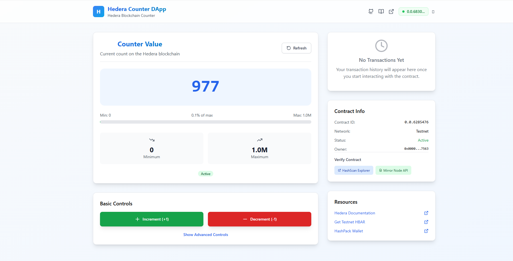

# Hedera Counter DApp - Complete Educational Project

A comprehensive educational project demonstrating how to build a complete decentralized application (dApp) on the Hedera blockchain. This project includes a smart contract, modern web frontend, and extensive documentation for blockchain beginners.

## 🎯 Project Overview

This project demonstrates:
- **Smart Contract Development**: A feature-rich counter contract written in Solidity
- **Frontend Integration**: Modern React/Next.js application with TypeScript
- **Wallet Integration**: HashPack wallet connection and transaction signing
- **Real-time Updates**: Live contract state monitoring and transaction tracking
- **Educational Content**: Comprehensive tutorials and explanations

## 📸 Application Screenshot



*The Hedera Counter DApp interface showing the counter value, transaction controls, contract verification links, and real-time transaction history.*

## 🌟 Features

### Smart Contract Features
- ✅ Increment/Decrement counter by 1 or custom amounts
- ✅ Owner-only reset functionality
- ✅ Pause/unpause contract operations
- ✅ Comprehensive error handling and validation
- ✅ Event emission for all operations
- ✅ Gas-optimized design

### Frontend Features
- ✅ Modern, responsive UI with Tailwind CSS
- ✅ Real-time counter value display with progress visualization
- ✅ Multi-wallet support via Hedera WalletConnect (HashPack, Blade, Kabila, etc.)
- ✅ Transaction history and status tracking
- ✅ Error handling and user feedback
- ✅ Mobile-friendly design

## 🦊 MetaMask Wallet Setup Guide

### Step 1: Download and Install MetaMask

1. **Visit the Official MetaMask Website**
   - Go to [https://metamask.io/](https://metamask.io/)
   - Click "Download" button

2. **Install Browser Extension**
   - Choose your browser (Chrome, Firefox, Edge, or Brave)
   - Click "Install MetaMask for [Your Browser]"
   - Add the extension to your browser
   - Pin the MetaMask extension to your browser toolbar for easy access

3. **Initial Setup**
   - Click the MetaMask fox icon in your browser
   - Choose "Create a new wallet" (for new users) or "Import an existing wallet"
   - Create a strong password (at least 8 characters)
   - **⚠️ IMPORTANT**: Write down your Secret Recovery Phrase and store it safely!

### Step 2: Configure MetaMask for Hedera Network

MetaMask doesn't include Hedera networks by default, so we need to add them manually:

1. **Open MetaMask Settings**
   - Click the MetaMask icon
   - Click your account avatar (top right)
   - Select "Settings" → "Networks" → "Add Network"

2. **Add Hedera Testnet Network**
   ```
   Network Name: Hedera Testnet
   New RPC URL: https://testnet.hashio.io/api
   Chain ID: 296
   Currency Symbol: HBAR
   Block Explorer URL: https://hashscan.io/testnet
   ```

3. **Add Hedera Mainnet Network** (Optional - for production use)
   ```
   Network Name: Hedera Mainnet
   New RPC URL: https://mainnet.hashio.io/api
   Chain ID: 295
   Currency Symbol: HBAR
   Block Explorer URL: https://hashscan.io/mainnet
   ```

4. **Save and Switch Networks**
   - Click "Save" to add the network
   - Switch to "Hedera Testnet" from the network dropdown

### Step 3: Import Your Hedera Account

If you already have a Hedera account, you can import it into MetaMask:

1. **Get Your Private Key**
   - From Hedera Portal or your existing wallet
   - **⚠️ WARNING**: Never share your private key with anyone!

2. **Import Account in MetaMask**
   - Click your account avatar → "Import Account"
   - Select "Private Key" as import type
   - Paste your Hedera private key (with or without 0x prefix)
   - Click "Import"

3. **Verify Import**
   - Your account should appear with your HBAR balance
   - Account ID format: 0.0.xxxxxx

## 💰 Hedera Account Creation and Funding Guide

### Step 1: Create a Hedera Testnet Account

1. **Visit Hedera Portal**
   - Go to [https://portal.hedera.com/](https://portal.hedera.com/)
   - Click "Create Account" or "Get Started"

2. **Choose Account Type**
   - Select "Testnet" for development and testing
   - Click "Create Testnet Account"

3. **Account Creation**
   - The portal will generate a new account automatically
   - You'll receive:
     - **Account ID** (format: 0.0.xxxxxx)
     - **Public Key** (starts with 302a300506...)
     - **Private Key** (starts with 302e020100... or hex format)

4. **Save Your Credentials**
   ```
   Account ID: 0.0.1234567
   Private Key: 302e020100300506032b657004220420...
   Public Key: 302a300506032b6570032100...
   ```
   - **⚠️ CRITICAL**: Save these credentials securely!
   - Store them in a password manager or secure note-taking app

### Step 2: Fund Your Account with Testnet HBAR

1. **Automatic Funding**
   - New testnet accounts usually receive 1000 HBAR automatically
   - Wait 1-2 minutes for the funding to appear

2. **Manual Faucet (if needed)**
   - Visit [https://portal.hedera.com/](https://portal.hedera.com/)
   - Log in with your account credentials
   - Look for "Testnet Faucet" or "Get HBAR" button
   - Request additional HBAR (usually 1000 HBAR per request)

3. **Alternative Faucet Sources**
   - [Hedera Faucet](https://portal.hedera.com/) (Official)
   - Community faucets (check Hedera Discord for links)

### Step 3: Verify Your Account

1. **Check Balance on HashScan**
   - Visit [https://hashscan.io/testnet](https://hashscan.io/testnet)
   - Search for your Account ID (0.0.xxxxxx)
   - Verify your HBAR balance appears

2. **Import to MetaMask**
   - Follow the MetaMask setup guide above
   - Import your account using the private key
   - Verify the balance shows in MetaMask

## 🚀 Complete Installation Guide

### Prerequisites Checklist

Before starting, ensure you have these installed:

- ✅ **Node.js** (v18.0.0 or higher) - [Download here](https://nodejs.org/)
- ✅ **npm** (comes with Node.js) or **yarn**
- ✅ **Git** - [Download here](https://git-scm.com/)
- ✅ **MetaMask Browser Extension** (see guide above)
- ✅ **Hedera Testnet Account** with HBAR (see guide above)
- ✅ **Code Editor** (VS Code recommended)

**Check Your Versions:**
```bash
node --version    # Should be v18.0.0 or higher
npm --version     # Should be 8.0.0 or higher
git --version     # Any recent version
```

### Step 1: Clone the Repository

1. **Open Terminal/Command Prompt**
   - Windows: Press `Win + R`, type `cmd`, press Enter
   - Mac: Press `Cmd + Space`, type "Terminal", press Enter
   - Linux: Press `Ctrl + Alt + T`

2. **Navigate to Your Desired Directory**
   ```bash
   # Example: Navigate to Desktop
   cd Desktop

   # Or create a new projects folder
   mkdir blockchain-projects
   cd blockchain-projects
   ```

3. **Clone the Repository**
   ```bash
   git clone https://github.com/walterthesmart/Hedera-Counter-Dapp.git
   cd Hedera-Counter-Dapp
   ```

### Step 2: Install Dependencies

1. **Install Root Dependencies**
   ```bash
   npm install
   ```

   **Expected Output:**
   ```
   added 245 packages, and audited 246 packages in 15s
   ```

2. **Install Smart Contract Dependencies**
   ```bash
   cd smart-contract
   npm install
   cd ..
   ```

3. **Install Frontend Dependencies**
   ```bash
   cd frontend
   npm install
   cd ..
   ```

**⚠️ Troubleshooting Installation Issues:**
- If you get permission errors, try: `npm install --no-optional`
- For Windows users with Python errors: `npm install --ignore-scripts`
- If installation fails, delete `node_modules` and try again

### Step 3: Environment Configuration

1. **Create Environment Files**
   ```bash
   # Copy the example environment file
   cp .env.example .env

   # For Windows users:
   copy .env.example .env
   ```

2. **Configure Main Environment File (.env)**

   Open `.env` in your code editor and update with your Hedera account details:

   ```env
   # Hedera Network Configuration
   HEDERA_NETWORK=testnet

   # Your Hedera Account Details (from portal.hedera.com)
   HEDERA_ACCOUNT_ID=0.0.1234567
   HEDERA_PRIVATE_KEY=302e020100300506032b657004220420abcd1234...

   # These will be auto-populated after contract deployment
   CONTRACT_ID=
   CONTRACT_ADDRESS=
   NEXT_PUBLIC_CONTRACT_ID=
   ```

3. **Configure Frontend Environment**
   ```bash
   cd frontend
   cp .env.local.example .env.local
   ```

   Edit `frontend/.env.local`:
   ```env
   # Hedera Network
   NEXT_PUBLIC_HEDERA_NETWORK=testnet

   # App Configuration
   NEXT_PUBLIC_APP_NAME=Hedera Counter DApp
   NEXT_PUBLIC_APP_DESCRIPTION=A simple counter DApp on Hedera

   # Contract ID (will be populated after deployment)
   NEXT_PUBLIC_CONTRACT_ID=
   ```

### Step 4: Compile and Deploy Smart Contract

1. **Compile the Smart Contract**
   ```bash
   cd smart-contract
   npm run compile
   ```

   **Expected Output:**
   ```
   Compiled 1 Solidity file successfully
   ```

2. **Deploy to Hedera Testnet**
   ```bash
   npm run deploy
   ```

   **Expected Output:**
   ```
   🚀 Starting Hedera Counter Contract Deployment...
   🌐 Connected to Hedera Testnet
   📄 Contract bytecode loaded successfully
   ⏳ Deploying Counter contract...
   ✅ Contract deployed successfully!
   📋 Contract ID: 0.0.6285476
   📍 Contract Address: 0x00000000000000000000000000000000005fd844
   ```

3. **Verify Deployment**
   - The script automatically updates your `.env` files
   - Check that `CONTRACT_ID` and `NEXT_PUBLIC_CONTRACT_ID` are now populated
   - Visit the HashScan link provided to see your contract

### Step 5: Start the Frontend Application

1. **Navigate to Frontend Directory**
   ```bash
   cd ../frontend
   ```

2. **Start Development Server**
   ```bash
   npm run dev
   ```

   **Expected Output:**
   ```
   ready - started server on 0.0.0.0:3000, url: http://localhost:3000
   ```

3. **Open Your DApp**
   - Visit `http://localhost:3000` in your browser
   - You should see the Hedera Counter DApp interface

### Step 6: Connect Your Wallet and Test

1. **Connect MetaMask**
   - Click "Connect MetaMask" button in the top-right
   - Approve the connection in MetaMask
   - Ensure you're on Hedera Testnet network

2. **Test Contract Functions**
   - Try incrementing the counter
   - Try decrementing the counter
   - Check transaction history
   - Verify transactions on HashScan

### Verification Checklist

✅ **Installation Complete When:**
- [ ] All dependencies installed without errors
- [ ] Environment files configured with your account details
- [ ] Smart contract compiled successfully
- [ ] Contract deployed to Hedera testnet
- [ ] Frontend starts on `http://localhost:3000`
- [ ] MetaMask connects successfully
- [ ] Counter increment/decrement works
- [ ] Transactions appear in history

### Common Installation Issues and Solutions

#### Issue: "Node.js version too old"
**Solution:**
```bash
# Update Node.js to latest LTS version
# Visit https://nodejs.org/ and download latest version
```

#### Issue: "HEDERA_PRIVATE_KEY not found"
**Solution:**
- Double-check your `.env` file has the correct private key
- Ensure no extra spaces or quotes around the key
- Verify the key starts with `302e020100...` or is in hex format

#### Issue: "Insufficient Account Balance"
**Solution:**
- Get more testnet HBAR from [portal.hedera.com](https://portal.hedera.com/)
- Wait a few minutes for funding to appear
- Check your balance on [hashscan.io/testnet](https://hashscan.io/testnet)

#### Issue: "MetaMask connection failed"
**Solution:**
- Ensure MetaMask is installed and unlocked
- Verify Hedera Testnet network is added to MetaMask
- Check that you're on the correct network (Chain ID: 296)

#### Issue: "Contract deployment failed"
**Solution:**
- Verify your account has sufficient HBAR (need ~5 HBAR for deployment)
- Check your private key is correct in `.env`
- Ensure you're connected to testnet, not mainnet

## 📚 Understanding Hedera Blockchain

### What is Hedera?

Hedera is a public distributed ledger that offers:
- **High Performance**: 10,000+ transactions per second
- **Low Fees**: Predictable, low-cost transactions
- **Energy Efficient**: Proof-of-Stake consensus
- **Enterprise Grade**: Built for real-world applications

### Key Concepts

#### 1. **Accounts**
- Every user has a unique Account ID (format: `0.0.xxxxx`)
- Accounts hold HBAR (Hedera's native cryptocurrency)
- Required for all blockchain interactions

#### 2. **Smart Contracts**
- Self-executing contracts with terms directly written into code
- Deployed to the blockchain with a unique Contract ID
- Can hold and transfer HBAR, store data, and execute logic

#### 3. **Transactions**
- All blockchain interactions are transactions
- Require HBAR to pay for network fees
- Provide cryptographic proof of execution

#### 4. **Consensus**
- Hedera uses Hashgraph consensus algorithm
- Provides fast finality and high throughput
- More energy-efficient than traditional blockchains

## 🔧 Project Structure

```
hedera-counter-dapp/
├── smart-contract/          # Smart contract code
│   ├── contracts/          # Solidity contracts
│   ├── scripts/           # Deployment scripts
│   ├── test/              # Contract tests
│   └── config/            # Configuration files
├── frontend/               # Next.js frontend application
│   ├── src/
│   │   ├── components/    # React components
│   │   ├── hooks/         # Custom React hooks
│   │   ├── pages/         # Next.js pages
│   │   ├── styles/        # CSS styles
│   │   ├── types/         # TypeScript types
│   │   └── utils/         # Utility functions
│   └── public/            # Static assets
├── docs/                  # Additional documentation
├── .env.example           # Environment variables template
└── README.md             # This file
```

## 💡 Smart Contract Deep Dive

### Counter.sol Explained

Our smart contract includes several key components:

#### State Variables
```solidity
uint256 private _count;        // Current counter value
address private _owner;        // Contract owner
bool private _paused;         // Pause state
```

#### Key Functions

1. **increment()** - Increases counter by 1
2. **decrement()** - Decreases counter by 1
3. **incrementBy(uint256)** - Increases by custom amount
4. **decrementBy(uint256)** - Decreases by custom amount
5. **getCount()** - Returns current value (view function)
6. **reset()** - Resets to 0 (owner only)

#### Security Features
- **Access Control**: Owner-only functions
- **Pause Mechanism**: Emergency stop functionality
- **Input Validation**: Boundary checks and error handling
- **Event Logging**: All operations emit events

### Gas Optimization

The contract is optimized for gas efficiency:
- Uses `private` variables with public getters
- Efficient storage layout
- Minimal external calls
- Batch operations support

## 🎨 Frontend Architecture

### Technology Stack

- **Next.js 14**: React framework with SSR/SSG
- **TypeScript**: Type-safe JavaScript
- **Tailwind CSS**: Utility-first CSS framework
- **Hedera SDK**: Official Hedera JavaScript SDK
- **React Hooks**: State management and side effects

### Key Components

#### 1. **WalletButton**
Handles wallet connection and displays connection status.

#### 2. **CounterDisplay**
Shows current counter value with visual progress indicators.

#### 3. **CounterControls**
Provides buttons for all contract interactions.

#### 4. **TransactionHistory**
Displays recent transactions with status tracking.

### Custom Hooks

#### useWallet
Manages wallet connection state and operations.

#### useContract
Handles all smart contract interactions.

#### useTransactions
Tracks transaction history and status.

## 🔐 Security Considerations

### Smart Contract Security
- **Reentrancy Protection**: Functions use proper state updates
- **Access Control**: Owner-only functions properly protected
- **Input Validation**: All inputs validated before processing
- **Pause Mechanism**: Emergency stop functionality

### Frontend Security
- **Environment Variables**: Sensitive data properly managed
- **Input Sanitization**: User inputs validated and sanitized
- **Error Handling**: Graceful error handling and user feedback
- **HTTPS Only**: Production deployment uses HTTPS

## 🧪 Testing

### Smart Contract Tests

Run the comprehensive test suite:

```bash
npm run test-contract
```

Tests cover:
- Basic functionality (increment/decrement)
- Access control (owner-only functions)
- Boundary conditions (min/max values)
- Error conditions (paused state, invalid inputs)
- Event emission verification

### Testing the Deployed Contract

After deployment, verify your contract works:

```bash
cd smart-contract
npm run verify
```

## 🚀 Deployment Guide

### Smart Contract Deployment

1. **Prepare Environment**
   ```bash
   # Ensure you have testnet HBAR
   # Update .env with your credentials
   ```

2. **Compile Contract**
   ```bash
   npm run compile-contract
   ```

3. **Deploy to Testnet**
   ```bash
   npm run deploy-contract
   ```

4. **Verify Deployment**
   ```bash
   cd smart-contract
   node scripts/verify.js
   ```

### Frontend Deployment

#### Vercel (Recommended)

1. **Connect Repository**
   - Import your GitHub repository to Vercel
   - Configure build settings

2. **Environment Variables**
   ```
   NEXT_PUBLIC_HEDERA_NETWORK=testnet
   NEXT_PUBLIC_CONTRACT_ID=0.0.YOUR_CONTRACT_ID
   NEXT_PUBLIC_APP_NAME=Hedera Counter DApp
   ```

3. **Deploy**
   - Vercel will automatically deploy on push to main branch

#### Manual Deployment

```bash
cd frontend
npm run build
npm run start
```

## 🔧 Configuration

### Network Configuration

The project supports multiple Hedera networks:

- **Testnet**: For development and testing
- **Mainnet**: For production deployment
- **Previewnet**: For preview features

Configure in `.env`:
```env
HEDERA_NETWORK=testnet  # or mainnet, previewnet
```

### Contract Configuration

Customize contract behavior in `smart-contract/contracts/Counter.sol`:

```solidity
uint256 public constant MAX_COUNT = 1000000;  // Maximum counter value
uint256 public constant MIN_COUNT = 0;        // Minimum counter value
```

## 🐛 Troubleshooting

### Common Issues

#### 1. **"Insufficient Account Balance"**
- **Cause**: Not enough HBAR for transaction fees
- **Solution**: Get testnet HBAR from [Hedera Portal](https://portal.hedera.com/)

#### 2. **"Contract Not Found"**
- **Cause**: Contract not deployed or wrong Contract ID
- **Solution**: Redeploy contract and update environment variables

#### 3. **"Wallet Connection Failed"**
- **Cause**: HashPack not installed or network mismatch
- **Solution**: Install HashPack and ensure correct network

#### 4. **"Transaction Timeout"**
- **Cause**: Network congestion or insufficient gas
- **Solution**: Retry transaction or increase gas limit

### Debug Mode

Enable debug logging:
```env
NODE_ENV=development
DEBUG=true
```

## 📖 Learning Resources

### Hedera Documentation
- [Official Docs](https://docs.hedera.com/)
- [Developer Portal](https://hedera.com/developers)
- [SDK Documentation](https://docs.hedera.com/hedera/sdks-and-apis)

### Solidity Resources
- [Solidity Documentation](https://docs.soliditylang.org/)
- [OpenZeppelin Contracts](https://openzeppelin.com/contracts/)
- [Smart Contract Security](https://consensys.github.io/smart-contract-best-practices/)

### Web3 Development
- [Web3 University](https://www.web3.university/)
- [Ethereum Development](https://ethereum.org/en/developers/)
- [DApp Architecture](https://www.dappuniversity.com/)

## 🤝 Contributing

We welcome contributions! Please see our [Contributing Guide](CONTRIBUTING.md) for details.

### Development Workflow

1. Fork the repository
2. Create a feature branch
3. Make your changes
4. Add tests if applicable
5. Submit a pull request

## 📄 License

This project is licensed under the MIT License - see the [LICENSE](LICENSE) file for details.

## 🙏 Acknowledgments

- **Hedera Team** for the excellent blockchain platform
- **HashPack Team** for the wallet integration
- **OpenZeppelin** for smart contract security patterns
- **Next.js Team** for the amazing React framework

## 📞 Support

- **GitHub Issues**: [Report bugs or request features](https://github.com/your-username/hedera-counter-dapp/issues)
- **Discord**: Join the [Hedera Discord](https://discord.gg/hedera)
- **Documentation**: Check our [detailed docs](./docs/)

---

**Happy Building! 🚀**

*This project is for educational purposes and demonstrates best practices for Hedera dApp development.*
